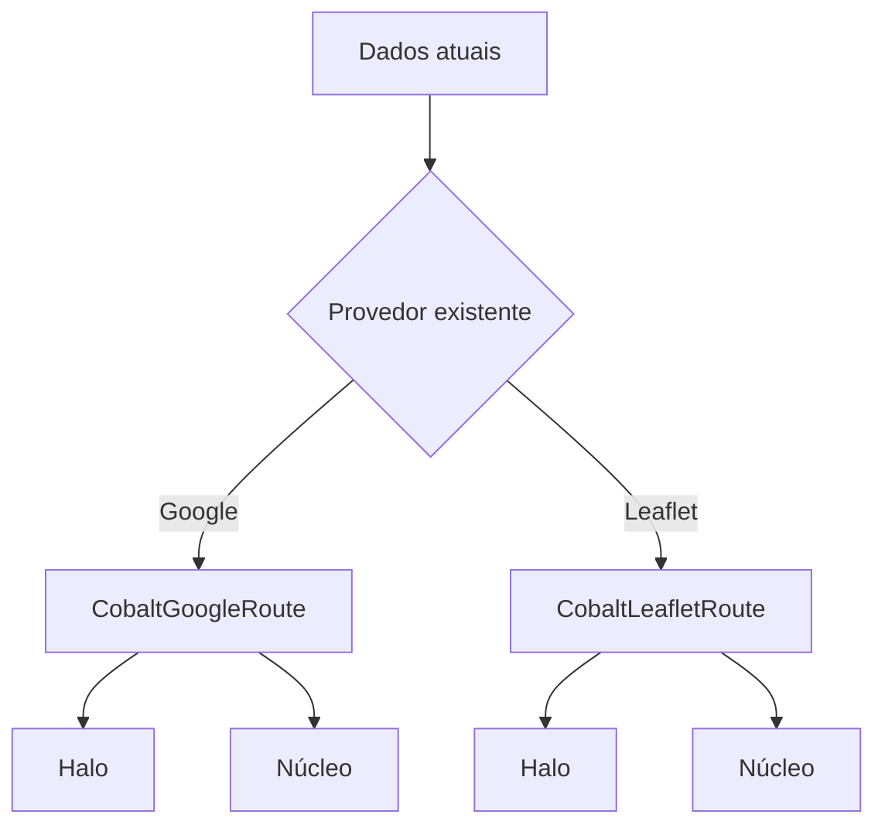

# Design técnico — Cobalto Líquido v2 no Painel Administrativo

## Visão geral

A migração preserva a arquitetura React, serviços, autenticação, autorização e rotas. O Cobalto será introduzido como uma camada visual tipada e progressiva. Componentes compartilhados concentram a mudança para reduzir duplicação e permitir validação por etapa.

## Fundação visual

Os assets serão organizados em `src/styles/cobalto/` e importados pelo ponto de entrada nesta ordem: tokens, animações e componentes. `@font-face` apontará para fontes locais em `public/fonts/`. `tailwind.config.js` mapeará cores, tipografia, raios e sombras para as variáveis, preservando utilitários existentes durante a transição.

`global.css` cuidará apenas de reset, fundo, tipografia-base, foco visível e integração do aplicativo. Tema escuro não será criado. O script `liquid.js` não será executado: interações serão declarativas nos componentes React e respeitarão `prefers-reduced-motion`. Atende 1.1–1.6 e 6.3–6.5.

## Componentes compartilhados

Botões, campos, cards, badges, tabelas, modais, toasts, skeletons e estados vazios manterão suas props e callbacks públicos sempre que possível, recebendo variantes semânticas tipadas (`primary`, `secondary`, `danger`, `success`). A variante destrutiva nunca herdará Cobalto. Loading mantém bloqueio contra envio duplo e mensagem acessível.

`AppLayout` e `Sidebar` serão migrados usando as rotas e verificações de papel atuais. O item ativo terá indicador, texto e `aria-current`; mobile e rolagem continuarão funcionais. Atende 2.1–2.4 e 6.1–6.5.

## Dashboard

Os componentes atuais de KPI serão recompostos: o indicador prioritário usa superfície Safira e os demais, cartões claros. Tabela, pendências, skeleton, vazio e erro continuam alimentados pelas respostas atuais; nenhuma métrica ou linha é inventada. Atende 3.1–3.6.

## Mapas

### Google Maps — dashboard

`DashboardMap.tsx` conserva `APIProvider`, `Map`, `mapId`, câmera, filtros e `AdvancedMarker`. Marcadores receberão elementos React com cores semânticas e rótulos acessíveis. Quando houver uma geometria real decodificada, um componente `CobaltGoogleRoute` desenhará dois traços sobre a mesma lista de coordenadas: halo Cobalto translúcido, mais largo e abaixo; núcleo sólido, mais estreito e acima. A anotação atual de linha reta simplificada não será transformada em rota simulada.

### Leaflet/OpenStreetMap — detalhe da viagem

`TravelMap.tsx` mantém `MapContainer`, `TileLayer`, markers, popups e ajuste de bounds. Sua interface poderá receber posições reais da rota como propriedade opcional tipada. `CobaltLeafletRoute` renderiza duas `<Polyline>` sobre as mesmas posições. Sem geometria, nenhum traço é exibido. Atende 4.1–4.7.

## Formulários

Os formulários existentes serão compostos em seções visuais sem alterar campos. Máscaras, schemas, mensagens de backend, senha administrativa e controle de concorrência continuam nas camadas atuais. Erros ficam associados aos inputs via `aria-describedby`; envio mostra loading e desabilita nova submissão. A migração começa por motorista e passageiro e aplica os mesmos primitivos a frota, unidades, termos e configurações. Atende 5.1–5.5.

## Tipos e interfaces

- Nenhum `any` será introduzido.
- Variantes visuais serão unions TypeScript.
- Coordenadas continuarão usando os tipos dos provedores ou tipos de domínio explícitos.
- Props opcionais de rota distinguem “sem geometria” de lista válida; o componente não calcula rota.

## Validação

- Testes unitários dos primitivos: variantes, loading, foco, erros e acessibilidade.
- Testes dos adaptadores de mapa: duas camadas, mesmos pontos, ordem e ausência quando não há geometria.
- Testes de integração: sidebar/permissões, dashboard nos quatro estados e formulários com sucesso/erro/envio duplicado.
- `tsc -b`, build de produção e suíte automatizada serão executados, comparando resultados à baseline documentada. Atende 7.1–7.4.

## Rastreabilidade

| Requisitos | Solução |
|---|---|
| 1.1–1.6 | CSS em camadas, fontes locais e Tailwind tokenizado |
| 2.1–2.4 | Layout/Sidebar preservando rotas e papéis |
| 3.1–3.6 | Dashboard recomposto com dados existentes |
| 4.1–4.7 | Adaptadores por provedor com rota em duas camadas |
| 5.1–5.5 | Primitivos de formulário sem mudança de contrato |
| 6.1–6.5 | Biblioteca compartilhada e acessível |
| 7.1–7.4 | Tipagem, build e testes contra baseline |
