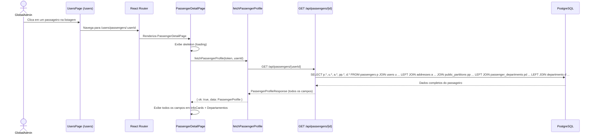

# Documento de Design — Passenger Fetching

---
**Propósito**: Fornecer detalhes suficientes para implementar a consulta individual de passageiros e a página de detalhes dedicada no painel Moto, cobrindo backend (enriquecimento do endpoint) e frontend (API client + página + rota + testes).

---

## Visão Geral

**Propósito**: Esta funcionalidade substitui a atual página "Em breve" (`ComingSoonPage`) na rota `/users/passengers/:userId` por uma página de detalhes completa do passageiro. Para viabilizar uma experiência rica, o backend precisa enriquecer o endpoint `GET /api/passengers/{passengerId}` para incluir campos que já estão disponíveis no endpoint de listagem (`GET /api/passengers`). O frontend então implementa a função de API, a página de detalhes e os testes automatizados.

**Usuários**: Administradores com role GlobalAdmin acessarão a página de detalhes a partir da listagem de usuários (`/users`), clicando em um passageiro específico.

**Impacto**:
- **Backend**: Altera o handler/repositório de `GetByPassengerIdAsync` para incluir joins adicionais (address, public_partition) e campos extras no DTO de resposta.
- **Frontend**: Cria novo arquivo `PassengerDetailPage.tsx`, adiciona função `fetchPassengerProfile` no `userApi.ts`, altera `App.tsx` e cria arquivo de testes.

### Objetivos
- Enriquecer `GET /api/passengers/{passengerId}` com campos completos do passageiro.
- Criar `fetchPassengerProfile` no frontend seguindo o padrão `fetchDriverProfile`.
- Criar `PassengerDetailPage` exibindo todos os dados do passageiro.
- Substituir `ComingSoonPage` pela nova página no roteador.
- Adicionar testes automatizados para a página de detalhes.

### Não-Objetivos
- Não criar ou modificar o endpoint de listagem (`GET /api/passengers`) — já retorna dados completos.
- Não criar endpoint de atualização (PUT/PATCH) de passageiro.
- Não modificar a página de criação de passageiro (`PassengerCreationPage`).
- Não adicionar links de navegação na Sidebar (a navegação já existe via `/users`).
- Não modificar a página `UsersPage` (a tabela de usuários já lista passageiros com links).

## Arquitetura

### Análise da Arquitetura Existente

- **Backend — PassengerController**: Já expõe `GET /api/passengers/{passengerId}` com autorização `GlobalAdminAccess`. O handler atual retorna um `PassengerProfileResponse` enxuto.
- **Backend — PassengerRepository**: Possui `GetByPassengerIdAsync` que faz join com `users` e `passenger_departments`/`departments`, mas não inclui `addresses` nem `public_partitions`.
- **Frontend — `userApi.ts`**: Possui `fetchDriverProfile` como padrão de função de fetch individual. Usa `fetchProtected` do `authApi.ts`.
- **Frontend — `userListApi.ts`**: Possui `PassengerListItem` com todos os campos necessários (15+ campos), servindo como referência de contrato.
- **Frontend — `DriverDetailPage.tsx`**: Padrão completo de página de detalhes com estados loading/loaded/error/notFound, skeleton, InfoCards e botão Voltar.
- **Frontend — `App.tsx`**: Rota `/users/passengers/:userId` já existe dentro do grupo protegido por GlobalAdmin, atualmente apontando para `ComingSoonPage`.

### Padrão Arquitetural

| Aspecto | Detalhe |
|---------|---------|
| Padrão | Backend: enriquecimento de DTO existente. Frontend: nova página seguindo padrão DriverDetailPage |
| Limites | Backend: alteração em repositório + handler/DTO. Frontend: nova função API + nova página + alteração de rota |
| Padrões preservados | fetchProtected, union types (ok/error), skeletons, InfoCards, tratamento 404/error |
| Novos componentes | `PassengerDetailPage.tsx` e seus testes |

### Tecnologia

| Camada | Escolha | Papel na Funcionalidade | Observações |
|--------|---------|--------------------------|-------------|
| Backend API | ASP.NET Core | Enriquecer endpoint GET passenger | Alterar PassengerProfileResponse DTO e repository |
| Backend ORM | Entity Framework Core | Joins adicionais (addresses, public_partitions) | Incluir `.ThenInclude` no repositório |
| Frontend HTTP | `fetchProtected` (authApi.ts) | Chamada autenticada ao endpoint | Já existente |
| Frontend UI | React + TypeScript | Página de detalhes | Novo componente |
| Frontend Rotas | React Router v6 | `useParams`, `useNavigate` | Já em uso |
| Frontend Ícones | `lucide-react` (`User`, `Mail`, `MapPin`, `Building2`, `Calendar`, `Hash`, `ShieldCheck`, etc.) | Ícones dos InfoCards | Já presente |
| Frontend Testes | Vitest + React Testing Library | Testes da PassengerDetailPage | Já configurado |

## Fluxo do Sistema



## Rastreabilidade de Requisitos

| Requisito | Resumo | Componentes | Interfaces | Fluxo |
|-----------|--------|-------------|------------|-------|
| 1.1 | Endpoint enriquecido com todos os campos | Backend: PassengerController, PassengerProfileResponse, PassengerRepository | GET /api/passengers/{id} | Passenger detail flow |
| 1.2 | Proteção GlobalAdmin mantida | Backend: PassengerController | [Authorize] attribute | — |
| 1.3 | HTTP 404 para passageiro inexistente | Backend: PassengerRepository | GetByPassengerIdAsync → null | Error handling |
| 1.4 | Consistência com PassengerListItem | Backend: PassengerProfileResponse DTO | Campos alinhados com list endpoint | — |
| 2.1 | Função fetchPassengerProfile | userApi.ts | fetchProtected | Passenger detail flow |
| 2.2 | Interface PassengerProfile completa | userApi.ts | TypeScript interface | — |
| 2.3 | Union type de resultado | userApi.ts | PassengerProfileResult | Error handling |
| 2.4 | Mensagens de erro em pt-BR | userApi.ts | Strings de erro | Error handling |
| 3.1 | Página PassengerDetailPage | PassengerDetailPage.tsx | useParams, useAuth | Passenger detail flow |
| 3.2 | Exibição de todos os campos | PassengerDetailPage.tsx | InfoCard components | — |
| 3.3 | Botão Voltar | PassengerDetailPage.tsx | useNavigate → /users | — |
| 3.4 | Skeleton de carregamento | PassengerDetailPage.tsx | DetailSkeleton | Loading state |
| 3.5 | Estado "não encontrado" | PassengerDetailPage.tsx | 404 handling | Error handling |
| 3.6 | Estado de erro com retry | PassengerDetailPage.tsx | Error + retry button | Error handling |
| 3.7 | Lista de departamentos | PassengerDetailPage.tsx | Departments section | — |
| 4.1 | Registro da rota | App.tsx | Route /users/passengers/:userId | — |
| 5.1 | Testes automatizados | PassengerDetailPage.test.tsx | Vitest + RTL mocks | — |

## Componentes e Interfaces

### Backend — PassengerController / PassengerProfileResponse

#### Enriquecimento do DTO `PassengerProfileResponse`

| Campo | Tipo | Fonte | Observação |
|-------|------|-------|------------|
| PassengerId | Guid | passengers.passenger_id | ✅ Já existe |
| FullName | string | passengers.full_name | ✅ Já existe |
| Email | string | users.email | ✅ Já existe |
| Departments | PassengerDepartmentDto[] | passenger_departments + departments | ✅ Já existe |
| **Cpf** | string | passengers.cpf | 🆕 Adicionar |
| **Rg** | string | passengers.rg | 🆕 Adicionar |
| **Registration** | string | passengers.registration | 🆕 Adicionar |
| **Birthdate** | DateTime | passengers.birthdate | 🆕 Adicionar |
| **Address** | AddressDto | addresses (via address_id) | 🆕 Adicionar (lineOne, lineTwo, district, city, state, postalCode, countryCode) |
| **PublicPartitionId** | Guid | passengers.public_partition_id | 🆕 Adicionar |
| **PublicPartitionName** | string | public_partitions.name | 🆕 Adicionar |
| **IsActive** | bool | users.is_active | 🆕 Adicionar |
| **CreatedAt** | DateTime | passengers.created_at | 🆕 Adicionar |
| **SolicitationCount** | int | travel_orders (count) | 🆕 Adicionar |

#### Alterações no Repository (`GetByPassengerIdAsync`)

Adicionar os seguintes `.Include` / `.ThenInclude`:
```
.Include(p => p.User)
.Include(p => p.Address)
.Include(p => p.PublicPartition)
.Include(p => p.PassengerDepartments).ThenInclude(pd => pd.Department)
```

### Frontend — `src/api/userApi.ts`

#### Nova interface `PassengerProfile`

```typescript
export interface AddressDto {
  lineOne: string
  lineTwo?: string | null
  district?: string | null
  city: string
  state: string
  postalCode?: string | null
  countryCode: string
}

export interface PassengerDepartmentDto {
  departmentId: string
  name: string
}

export interface PassengerProfile {
  passengerId: string
  fullName: string
  email: string
  cpf: string
  rg: string
  registration: string
  birthdate: string
  address: AddressDto
  publicPartitionId: string
  publicPartitionName: string
  departments: PassengerDepartmentDto[]
  isActive: boolean
  createdAt: string
  solicitationCount: number
}
```

#### Nova função `fetchPassengerProfile`

```typescript
export type PassengerProfileResult =
  | { ok: true; data: PassengerProfile }
  | { ok: false; status: number; message: string }

export async function fetchPassengerProfile(
  token: string,
  passengerId: string,
): Promise<PassengerProfileResult> {
  const result = await fetchProtected<PassengerProfile>(
    `/api/passengers/${passengerId}`,
    token,
  )
  if (result.ok) return { ok: true, data: result.data }
  return {
    ok: false,
    status: result.status,
    message:
      result.status === 404
        ? 'Passageiro não encontrado.'
        : 'Erro ao carregar dados do passageiro. Tente novamente.',
  }
}
```

### Frontend — `src/pages/PassengerDetailPage.tsx`

#### Estrutura do componente

| Estado | Renderização |
|--------|-------------|
| `loading` | `<DetailSkeleton />` — animação de placeholder |
| `loaded` | Header com nome + botão Voltar, grid de InfoCards (2 colunas), seção de Departamentos, seção de Endereço |
| `notFound` | Mensagem "Passageiro não encontrado" + botão "Voltar para Usuários" |
| `error` | Banner de erro com mensagem + botão "Tentar novamente" |

#### InfoCards a exibir

| Coluna 1 | Coluna 2 |
|----------|----------|
| Nome completo (ícone `User`) | E-mail (ícone `Mail`) |
| CPF (ícone `Hash`) | RG (ícone `Hash`) |
| Matrícula (ícone `Hash`) | Data de nascimento (ícone `Calendar`) |
| Departamento (ícone `Building2`) | Partição pública (ícone `Building2`) |
| Status — Ativo/Inativo (ícone `ShieldCheck`/`ShieldX`) | Data de cadastro (ícone `Calendar`) |
| Solicitações (ícone `ClipboardList`) | — |

#### Seções adicionais

- **Departamentos**: Card dedicado listando todos os departamentos associados (do array `departments`), ou mensagem "Nenhum departamento associado." se vazio.
- **Endereço**: Card dedicado exibindo endereço formatado: `lineOne, lineTwo (se houver), district — city/state, postalCode, countryCode`.

#### Dependências
- `useParams` → obter `userId` da URL
- `useAuth` → obter `token`
- `useNavigate` → botão Voltar
- `fetchPassengerProfile` → buscar dados
- Ícones: `ArrowLeft, User, Mail, MapPin, Building2, Calendar, Hash, ShieldCheck, ShieldX, ClipboardList, Loader2` de `lucide-react`

### Frontend — `src/App.tsx`

#### Alteração na rota (linha 64)

**Antes:**
```tsx
<Route path="/users/passengers/:userId" element={<ComingSoonPage />} />
```

**Depois:**
```tsx
<Route path="/users/passengers/:userId" element={<PassengerDetailPage />} />
```

Adicionar import:
```typescript
import PassengerDetailPage from './pages/PassengerDetailPage'
```

### Frontend — `src/__tests__/PassengerDetailPage.test.tsx`

#### Cenários de teste

1. **Renderização do skeleton**: Verificar que durante loading, o skeleton é exibido (elementos com classe `animate-pulse`).
2. **Exibição de dados com sucesso**: Mockar `fetchPassengerProfile` retornando `{ ok: true, data: mockPassenger }`. Verificar que nome, email, CPF, RG, matrícula, data nascimento, departamento, partição, endereço, status, data cadastro, solicitações e departamentos são exibidos.
3. **Estado "não encontrado"**: Mockar retornando `{ ok: false, status: 404 }`. Verificar mensagem "Passageiro não encontrado" e botão "Voltar para Usuários".
4. **Estado de erro**: Mockar retornando `{ ok: false, status: 500 }`. Verificar mensagem de erro e botão "Tentar novamente".
5. **Lista de departamentos vazia**: Mockar passageiro com `departments: []`. Verificar mensagem "Nenhum departamento associado."

## Tratamento de Erros

| Cenário | Tratamento |
|---------|-----------|
| API retorna 404 | Exibir página "Passageiro não encontrado" com botão de retorno |
| API retorna 401/403 | O `fetchProtected` redireciona automaticamente para `/login` |
| API retorna 500/outros | Exibir banner de erro com mensagem e botão "Tentar novamente" |
| Erro de rede (fetch falha) | Tratado pelo `fetchProtected` como status 0, exibido como erro genérico |
| userId inválido na URL | Backend retorna 404, tratado pelo frontend como "não encontrado" |

## Estratégia de Testes

### Testes Unitários (Frontend)
1. `PassengerDetailPage` renderiza skeleton durante carregamento.
2. `PassengerDetailPage` exibe todos os campos quando dados são carregados.
3. `PassengerDetailPage` exibe estado "não encontrado" para 404.
4. `PassengerDetailPage` exibe estado de erro para outros status codes.
5. `PassengerDetailPage` exibe departamentos corretamente (com itens e vazio).

### Testes de Integração (Backend)
- Verificar que `GET /api/passengers/{passengerId}` retorna todos os campos esperados.
- Verificar que endpoint retorna 404 para ID inexistente.
- Verificar que endpoint requer autenticação GlobalAdmin.
