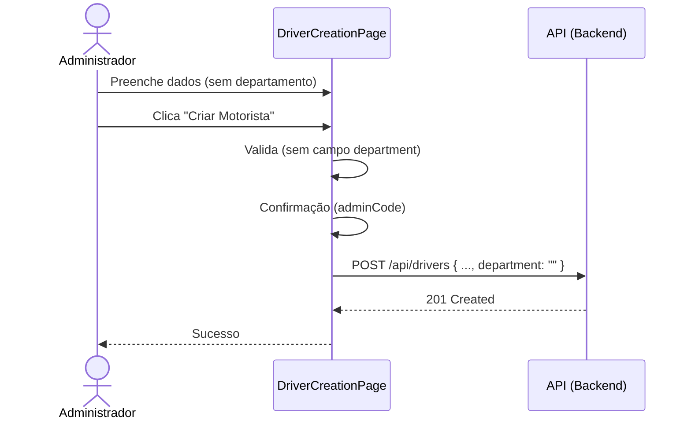
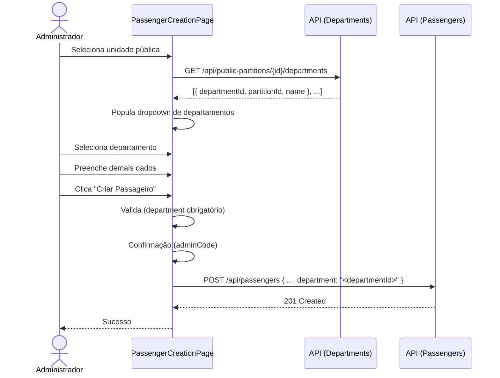

# Documento de Design — Registration Fix

---
**Propósito**: Fornecer detalhes suficientes para corrigir o fluxo de cadastro de motoristas e passageiros, garantindo consistência de implementação.

---

## Visão Geral

**Propósito**: Esta funcionalidade corrige o campo "Departamento" nos formulários de criação de motorista e passageiro do painel Moto. Para motoristas, o campo é removido da interface. Para passageiros, o campo passa a ser um dropdown populado dinamicamente a partir da unidade pública selecionada, consultando o endpoint `api/public-partitions/{id}/departments`.

**Usuários**: Administradores (GlobalAdmin) que criam motoristas e passageiros.

**Impacto**: Altera os componentes `DriverCreationPage.tsx` e `PassengerCreationPage.tsx`, além da API layer em `publicPartitionApi.ts` (adição de nova função).

### Objetivos
- Remover campo "Departamento" do formulário de criação de motorista.
- Renomear seção "Endereço e departamento" para "Endereço" no formulário de motorista.
- Adicionar função `fetchPartitionDepartments` na API layer para chamar `GET /api/public-partitions/{id}/departments`.
- Transformar campo "Departamento" de texto livre para dropdown seletor no formulário de passageiro.
- O dropdown de departamentos deve ser populado com base na unidade pública selecionada.
- Usar `departmentId` (em vez de texto livre) como valor enviado no `CreatePassengerRequest.department`.

### Não-Objetivos
- Não alterar o backend ou contratos de API.
- Não alterar o `CreateDriverRequest` — o campo `department` continuará sendo enviado como string vazia.
- Não alterar outros formulários (ex.: edição de motorista/passageiro, se existirem).
- Não alterar o `CreatePassengerRequest` interface no `userApi.ts` — apenas o valor enviado muda de texto livre para `departmentId`.

## Arquitetura

### Análise da Arquitetura Existente

- **DriverCreationPage.tsx**: Formulário controlado com estado `FormValues` contendo `department`. Seção "Endereço e departamento" com campo de texto `department`. Valida `validateRequired` para `department`.
- **PassengerCreationPage.tsx**: Formulário controlado com estado `FormValues` contendo `department` e `publicPartitionId`. Seção "Unidade" com select de unidades e seção "Endereço e departamento" com campo de texto `department`. O `publicPartitionId` já é um `<select>` populado via `listPartitions()`.
- **publicPartitionApi.ts**: Já exporta `DepartmentOption { departmentId, name }` e `fetchDepartments()`, mas o endpoint é `/api/departments` (genérico). Precisamos de um novo endpoint específico por partition.
- **FormField.tsx**: Suporta `type="select"` com `options: SelectOption[]`.

### Padrão Arquitetural

| Aspecto | Detalhe |
|---------|---------|
| Padrão | Modificações pontuais em componentes existentes, sem nova camada |
| Limites | Toda a lógica reside nos componentes de página + API layer |
| Padrões preservados | Uso de hooks, `fetchProtected`, estados de loading/error |
| Novos componentes | Nenhum |

### Tecnologia

| Camada | Escolha | Papel | Observações |
|--------|---------|-------|-------------|
| Frontend | React + TypeScript | Renderizar formulários | Já existente |
| API | fetch + `fetchProtected` | Chamada ao endpoint de departamentos | Já existente |
| Ícone | N/A | Nenhum novo ícone necessário | — |

### Mudanças Específicas

#### DriverCreationPage.tsx
| O quê | Como |
|-------|------|
| Campo `department` no FormValues | Manter no type (pois `CreateDriverRequest` ainda espera o campo), mas remover do JSX |
| Seção "Endereço e departamento" | Renomear heading para "Endereço" e remover o `<FormField id="department">` |
| Validação de `department` | Remover `e.department = validateRequired(...)` do `validate()` |
| Envio | No `handleConfirm`, usar `department: ''` (string vazia) |

#### PassengerCreationPage.tsx
| O quê | Como |
|-------|------|
| `fetchPartitionDepartments` | Nova função em `publicPartitionApi.ts` |
| Estado `departments` | Novo estado `Department[]` na página |
| Estado `departmentsLoading` | Novo estado booleano para loading |
| Estado `departmentsError` | Novo estado para mensagem de erro |
| Efeito | `useEffect` disparado quando `form.publicPartitionId` muda |
| Campo `department` | Mudar de `<FormField type="text">` para `<FormField type="select">` |
| Validação | Manter `validateRequired` para `department` |
| Comportamento condicional | Dropdown desabilitado se `!publicPartitionId`, ou loading, ou erro |

#### publicPartitionApi.ts
| O quê | Como |
|-------|------|
| Tipo `Department` | Adicionar interface com `departmentId`, `partitionId`, `name` (reutilizar ou estender `DepartmentOption`) |
| Função `fetchPartitionDepartments` | `GET /api/public-partitions/{partitionId}/departments` via `fetchProtected` |

## Fluxo do Sistema

### Fluxo de criação de motorista (simplificado)



### Fluxo de criação de passageiro (departamento dinâmico)



## Rastreabilidade de Requisitos

| Requisito | Resumo | Componentes | Interfaces | Fluxo |
|-----------|--------|-------------|------------|-------|
| 1.1 | Remover dept do form motorista | DriverCreationPage | — | Fluxo motorista |
| 1.2 | Renomear seção | DriverCreationPage | — | — |
| 1.3 | Enviar dept vazio na req | DriverCreationPage | `CreateDriverRequest` | Fluxo motorista |
| 2.1 | Buscar depts via API | PassengerCreationPage, publicPartitionApi | `fetchPartitionDepartments` | Fluxo passageiro |
| 2.2 | Resposta contém departmentId, partitionId, name | publicPartitionApi | `Department` type | — |
| 2.3 | Dropdown select | PassengerCreationPage | `FormField type="select"` | Fluxo passageiro |
| 2.4 | Loading state | PassengerCreationPage | Estado `departmentsLoading` | — |
| 2.5 | Nenhum dept disponível | PassengerCreationPage | Mensagem informativa | — |
| 2.6 | Erro na API | PassengerCreationPage | Mensagem de erro | — |
| 2.7 | Desabilitado sem unidade | PassengerCreationPage | Estado condicional | — |
| 3.1 | department = departmentId | PassengerCreationPage | `CreatePassengerRequest` | Fluxo passageiro |
| 3.2 | department = "" | DriverCreationPage | `CreateDriverRequest` | Fluxo motorista |
| 3.3 | Apenas frontend | — | — | — |

## Componentes e Interfaces

### API Layer

#### `publicPartitionApi.ts` — nova interface e função

```typescript
export interface Department {
  departmentId: string
  partitionId: string
  name: string
}

export type FetchPartitionDepartmentsResult =
  | { ok: true; data: Department[] }
  | { ok: false; status: number; message: string }

export async function fetchPartitionDepartments(
  token: string,
  partitionId: string,
): Promise<FetchPartitionDepartmentsResult> {
  const result = await fetchProtected<Department[]>(
    `/api/public-partitions/${partitionId}/departments`,
    token,
  )
  if (result.ok) return { ok: true, data: result.data }
  return {
    ok: false,
    status: result.status,
    message: 'Erro ao carregar departamentos. Tente novamente.',
  }
}
```

### DriverCreationPage.tsx — modificações

| Campo | Detalhe |
|-------|---------|
| Propósito | Remover campo department do formulário |
| Requisitos | 1.1, 1.2, 1.3 |

**Mudanças no JSX**:
- Seção "Endereço e departamento" → renomear para "Endereço"
- Remover bloco `<FormField id="department" ...>`

**Mudanças na validação**:
- Remover `e.department = validateRequired(...)`

**Mudanças no submit**:
- No `handleConfirm`, alterar `department: form.department` → `department: ''`

### PassengerCreationPage.tsx — modificações

| Campo | Detalhe |
|-------|---------|
| Propósito | Adicionar dropdown de departamentos dinâmico |
| Requisitos | 2.1–2.7, 3.1 |

**Novos estados**:
```typescript
const [departments, setDepartments] = useState<Department[]>([])
const [departmentsLoading, setDepartmentsLoading] = useState(false)
const [departmentsError, setDepartmentsError] = useState<string | undefined>()
```

**Novo efeito** (dispara quando `publicPartitionId` muda):
```typescript
useEffect(() => {
  if (!form.publicPartitionId || !token) {
    setDepartments([])
    setForm(f => ({ ...f, department: '' }))
    return
  }

  setDepartmentsLoading(true)
  setDepartmentsError(undefined)

  fetchPartitionDepartments(token, form.publicPartitionId).then(result => {
    setDepartmentsLoading(false)
    if (result.ok) {
      setDepartments(result.data)
    } else {
      setDepartmentsError(result.message)
      setDepartments([])
    }
  })
}, [form.publicPartitionId, token])
```

**Mudanças no JSX — campo department**:
- Trocar `<FormField id="department" label="Departamento" ... type="text">` por lógica condicional:

```tsx
// Substituir o FormField de texto por:
{form.publicPartitionId ? (
  departmentsLoading ? (
    <FormField id="department" label="Departamento" type="select" value="" onChange={() => {}} disabled options={[]} placeholder="Carregando departamentos..." />
  ) : departmentsError ? (
    <p className="text-sm text-red-500">{departmentsError}</p>
  ) : departments.length === 0 ? (
    <p className="text-sm text-yellow-600">Nenhum departamento disponível para esta unidade.</p>
  ) : (
    <FormField
      id="department"
      label="Departamento"
      type="select"
      value={form.department}
      onChange={set('department')}
      error={errors.department}
      options={departments.map(d => ({ value: d.departmentId, label: d.name }))}
    />
  )
) : (
  <FormField id="department" label="Departamento" type="select" value="" onChange={() => {}} disabled options={[]} placeholder="Selecione uma unidade primeiro" />
)}
```

**Mudanças na seção**:
- Renomear seção "Endereço e departamento" para "Endereço e departamento" (manter) — apenas o campo muda.
- Nota: o campo "Departamento" fica na seção de endereço, enquanto "Unidade" fica em seção separada. Isso se mantém.

## Tratamento de Erros

| Cenário | Comportamento |
|---------|---------------|
| Falha ao carregar departamentos | Exibir mensagem de erro no lugar do dropdown |
| Loading demorado | Estado `departmentsLoading` com feedback visual |
| Unidade não selecionada | Dropdown desabilitado com placeholder |
| Nenhum departamento disponível | Mensagem informativa amarela |
| Erro de rede/timeout | Capturado pelo `fetchProtected`, exibe mensagem padrão |

## Estratégia de Testes

### Testes Unitários — DriverCreationPage
1. Verificar que o campo "Departamento" não está presente no DOM.
2. Verificar que a seção está rotulada como "Endereço" (não "Endereço e departamento").
3. Verificar que a validação não falha por causa de departamento.

### Testes Unitários — PassengerCreationPage
1. Verificar que o campo "Departamento" é um `<select>` quando uma unidade é selecionada.
2. Verificar que o dropdown está desabilitado com placeholder quando nenhuma unidade é selecionada.
3. Verificar que `fetchPartitionDepartments` é chamado quando `publicPartitionId` muda.
4. Verificar que o dropdown exibe loading state enquanto departments são carregados.
5. Verificar que o dropdown exibe erro se a API falhar.

### Testes de API
1. Verificar que `fetchPartitionDepartments` chama o endpoint correto.
2. Verificar que o tipo `Department` corresponde à resposta esperada.
