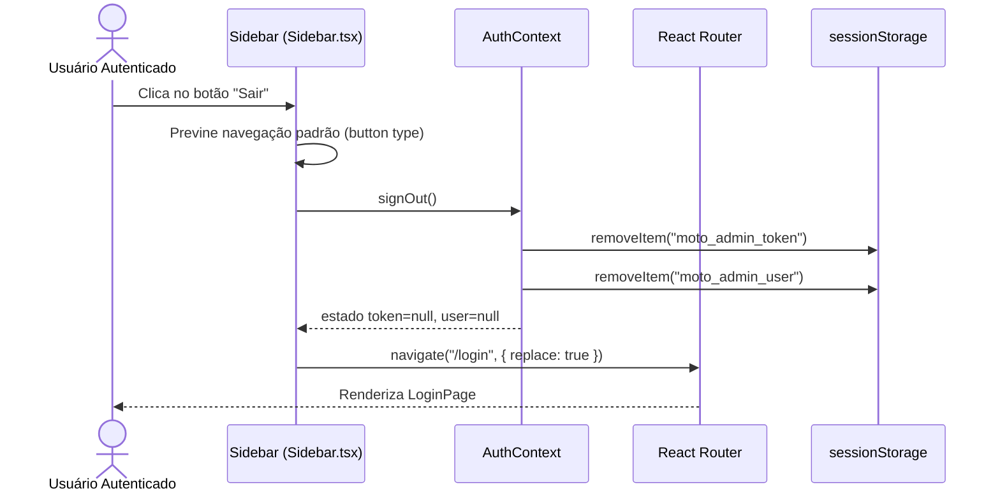

# Documento de Design — Sign-Out

---
**Propósito**: Fornecer detalhes suficientes para implementar a funcionalidade de sign-out no painel Moto, garantindo consistência de implementação.

---

## Visão Geral

**Propósito**: Esta funcionalidade adiciona um botão "Sair" na barra lateral do painel administrativo, permitindo que usuários autenticados encerrem suas sessões de forma explícita. A funcionalidade é puramente do lado do cliente (front-end): o `AuthContext` já possui o método `signOut()` que limpa o `sessionStorage`. A adição consiste em um ponto de acesso visual no componente `Sidebar`.

**Usuários**: Todos os usuários autenticados (GlobalAdmin, Driver, Passenger) utilizarão o botão para sair da aplicação.

**Impacto**: Altera o componente `Sidebar.tsx` existente — adiciona um botão de ação na parte inferior, abaixo dos links de navegação atuais. Não altera rotas, lógica de autenticação ou o contexto de autorização.

### Objetivos
- Adicionar um botão "Sair" visualmente distinto na parte inferior da `Sidebar`.
- Ao clicar, limpar a sessão (`sessionStorage`) e redirecionar para `/login`.
- Usar o ícone `LogOut` da biblioteca `lucide-react` (já presente no projeto).

### Não-Objetivos
- Não criar endpoint de sign-out no backend (não existe atualmente; pode ser adicionado futuramente).
- Não alterar a lógica do `AuthContext.signOut()` ou do `ProtectedRoute`.
- Não adicionar confirmação/modal de confirmação (ação direta).
- Não modificar o layout geral da `Sidebar` ou dos links de navegação existentes.

## Arquitetura

### Análise da Arquitetura Existente

- **AuthContext** (`src/auth/AuthContext.tsx`): Já expõe o método `signOut()` que remove `TOKEN_KEY` e `USER_KEY` do `sessionStorage` e reseta os estados `token` e `user` para `null`.
- **Sidebar** (`src/components/Sidebar.tsx`): Componente de navegação lateral que renderiza links via `<NavLink>` do React Router e utiliza `useAuth()` para verificar permissões.
- **ProtectedRoute** (`src/components/ProtectedRoute.tsx`): Quando `isAuthenticated` é `false`, redireciona para `/login`.
- **Router** (`src/App.tsx`): Define as rotas; `/login` não exige autenticação.

### Padrão Arquitetural

| Aspecto | Detalhe |
|---------|---------|
| Padrão | Adição pontual em componente existente, sem nova camada arquitetural |
| Limites | Toda a lógica reside no componente `Sidebar` |
| Padrões preservados | Uso de hooks (`useAuth`, `useNavigate`), separação de responsabilidades |
| Novos componentes | Nenhum — apenas alteração no `Sidebar.tsx` |

### Tecnologia

| Camada | Escolha | Papel na Funcionalidade | Observações |
|--------|---------|--------------------------|-------------|
| Frontend | React + TypeScript | Renderizar botão e gerenciar clique | Já existente |
| Roteamento | React Router v6 | `useNavigate` para redirecionar | Já existente |
| Ícone | `lucide-react` (`LogOut`) | Ícone do botão | Já presente no projeto |
| Estado global | React Context (`AuthContext`) | Chamar `signOut()` | Já existente |

## Fluxo do Sistema

## Rastreabilidade de Requisitos

| Requisito | Resumo | Componentes | Interfaces | Fluxo |
|-----------|--------|-------------|------------|-------|
| 1.1 | Botão "Sair" na parte inferior da Sidebar | Sidebar | useAuth | Sign-out flow |
| 1.2 | Visível para todos os papéis | Sidebar | useAuth | — |
| 1.3 | Botão semântico, não NavLink | Sidebar | — | — |
| 2.1 | Invoca signOut() do AuthContext | Sidebar, AuthContext | signOut() | Sign-out flow |
| 2.2 | Redireciona para /login com replace | Sidebar, Router | useNavigate | Sign-out flow |
| 3.1 | Separador visual antes do botão | Sidebar (CSS) | — | — |
| 3.2 | Ícone LogOut + texto "Sair" | Sidebar | lucide-react | — |
| 3.3 | Usar `<button>`, não `<NavLink>` | Sidebar | — | — |

## Componentes e Interfaces

### UI / Sidebar

#### `Sidebar` (modificação no componente existente)

| Campo | Detalhe |
|-------|---------|
| Propósito | Adicionar botão de sign-out na parte inferior |
| Requisitos | 1.1, 1.2, 1.3, 2.1, 2.2, 3.1, 3.2, 3.3 |

**Responsabilidades & Restrições**
- Renderizar o botão "Sair" após todos os links de navegação.
- Usar um `<button>` nativo (não `<NavLink>`) para evitar navegação acidental a uma rota.
- Chamar `signOut()` do `useAuth()` e depois `navigate('/login', { replace: true })`.
- O botão deve ser empurrado para o final do contêiner flexível da Sidebar (usando `mt-auto` ou similar).

**Dependências**
- Entrada: `AuthContext` via `useAuth()` — método `signOut()`
- Entrada: `react-router-dom` via `useNavigate()`

**Contratos**: State [x]

##### State

| Estado | Fonte | Descrição |
|--------|-------|-----------|
| `isAuthenticated` | `AuthContext` | Controla se o botão é renderizado |
| Navegação | React Router | Chamada imperativa via `navigate()` |

**Notas de Implementação**
- **Posicionamento**: O contêiner da Sidebar atualmente usa `flex flex-col`. O botão "Sair" deve ser o último filho, usando `mt-auto` para empurrá-lo para o fundo. Um divisor visual (`
` ou similar) deve separá-lo dos links de navegação.
- **Ícone**: Importar `LogOut` de `lucide-react` (já disponível, vide import de `Building2`, `Car`, etc.).
- **Estilo**: O botão deve seguir o mesmo padding/border-radius dos links da Sidebar (`rounded-xl px-3 py-3 text-sm font-medium`), mas com cores de texto em tom mais neutro/sutil (ex.: `text-slate-500 hover:text-red-600 hover:bg-red-50`) para indicar que é uma ação destrutiva.
- **Redirecionamento**: Usar `navigate('/login', { replace: true })` para evitar que o usuário volte para a página anterior usando o botão "Voltar" do navegador.
- **Chamada de API futura**: Se no futuro houver um endpoint de sign-out, deve-se adicionar um `await` antes do redirecionamento. Por ora, apenas a limpeza local é necessária.

## Tratamento de Erros

A funcionalidade não possui fluxos de erro significativos, pois:
- `signOut()` do `AuthContext` opera apenas no `sessionStorage` (síncrono, sem falhas).
- `navigate()` do React Router é uma operação de roteamento confiável.
- Se futuramente uma chamada de API for adicionada, um `try/catch` deverá ser introduzido para garantir que a sessão seja limpa mesmo em caso de falha de rede (degradação graciosa).

## Estratégia de Testes

### Testes Unitários
1. Verificar que o botão "Sair" é renderizado quando `isAuthenticated` é `true`.
2. Verificar que ao clicar no botão, `signOut()` é chamado.
3. Verificar que ao clicar no botão, `navigate('/login', { replace: true })` é chamado.
4. Verificar que o botão usa um elemento `<button>` (não `<a>` ou `<NavLink>`).

### Testes de Integração
1. Simular o fluxo completo: usuário autenticado → clica em "Sair" → sessão é limpa → usuário é redirecionado para `/login` → `ProtectedRoute` redireciona de volta para `/login` se tentar acessar rota protegida.
