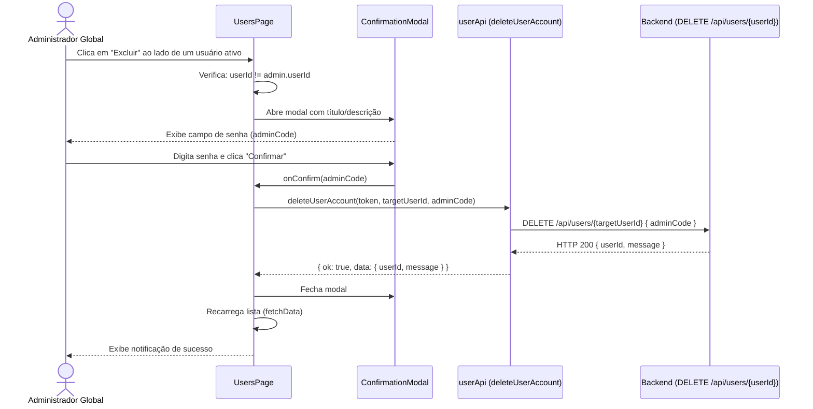
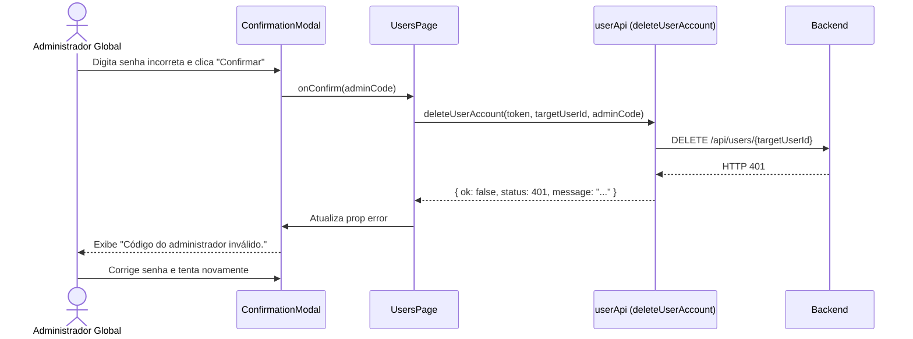
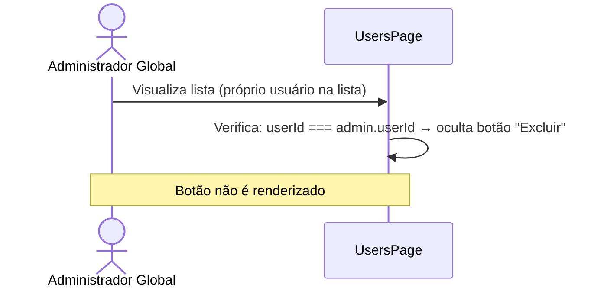

# Documento de Design — user-deletion-web

---
**Propósito**: Fornecer detalhes suficientes para implementar a funcionalidade de exclusão de usuários no painel Moto, garantindo consistência de implementação.

---

## Visão Geral

**Propósito**: Esta funcionalidade adiciona a capacidade de administradores globais desativarem contas de motoristas e passageiros diretamente pela interface web. A exclusão é soft-delete (marcar como inativo), utilizando o endpoint `DELETE /api/users/{userId}` do backend com re-verificação de credenciais (`adminCode`).

**Usuários**: Apenas administradores com papel `GlobalAdmin` (verificado via `hasMinimumRole('GlobalAdmin')`) podem excluir contas de outros usuários.

**Impacto**: Altera os componentes `UsersPage.tsx`, `DriverDetailPage.tsx` e `PassengerDetailPage.tsx` para adicionar botões de exclusão e o fluxo de confirmação. Adiciona uma função de API em `userApi.ts`. Reutiliza o componente `ConfirmationModal.tsx` existente.

### Objetivos
- Adicionar botão "Excluir" na tabela da lista de usuários (`UsersPage`).
- Adicionar botão "Excluir conta" nas páginas de detalhes (`DriverDetailPage`, `PassengerDetailPage`).
- Implementar fluxo de exclusão com confirmação via modal e re-verificação de senha (`adminCode`).
- Exibir feedback visual (notificação de sucesso/erro) e atualizar a interface após a exclusão.
- Impedir que o admin exclua sua própria conta.

### Não-Objetivos
- Não implementar o fluxo de auto-exclusão (self-deletion) — esse é um requisito mobile/outro endpoint.
- Não modificar o componente `ConfirmationModal` — ele será reutilizado como está.
- Não implementar sistema de toast global — a notificação será feita com um alerta inline no modal ou um componente leve.
- Não alterar a lógica de autenticação/autorização.
- Não adicionar rolagem, paginação ou filtros específicos para usuários inativos.

## Arquitetura

### Análise da Arquitetura Existente

- **ConfirmationModal** (`src/components/ConfirmationModal.tsx`): Componente de modal que recebe `title`, `description`, `onConfirm(adminCode)`, `onCancel`, `loading` e `error`. Já possui campo de senha e desabilita controles durante loading. Perfeito para reúso.
- **UsersPage** (`src/pages/UsersPage.tsx`): Lista paginada de motoristas/passageiros com coluna de ações (botão "Selecionar" que navega para detalhes).
- **DriverDetailPage** (`src/pages/DriverDetailPage.tsx`): Página de detalhes do motorista com informações do perfil e troca de veículo.
- **PassengerDetailPage** (`src/pages/PassengerDetailPage.tsx`): Página de detalhes do passageiro com informações do perfil e endereço.
- **AuthContext** (`src/auth/AuthContext.tsx`): Expõe `token`, `user` (com `userId`) e `hasMinimumRole`.
- **userApi.ts** (`src/api/userApi.ts`): Contém funções de API para perfis de usuário. Será estendida com a função de exclusão.

### Padrão Arquitetural

| Aspecto | Detalhe |
|---------|---------|
| Padrão | Adição pontual em componentes existentes + nova função de API, sem nova camada arquitetural |
| Limites | Lógica de exclusão encapsulada em cada componente que oferece a ação |
| Padrões preservados | Uso de hooks (`useAuth`, `useNavigate`, `useState`, `useCallback`), funções de API com padrão `{ ok, data/message }` |
| Novos componentes | Nenhum — `ConfirmationModal` já existe |
| Nova função de API | `deleteUserAccount` em `userApi.ts` |

### Tecnologia

| Camada | Escolha | Papel na Funcionalidade | Observações |
|--------|---------|--------------------------|-------------|
| Frontend | React + TypeScript | Renderizar botões e gerenciar fluxo de exclusão | Já existente |
| API HTTP | `fetchProtected` | Chamar `DELETE /api/users/{userId}` | Já existente |
| Modal | `ConfirmationModal` | Confirmar exclusão com adminCode | Já existente |
| Ícone | `lucide-react` (`Trash2`) | Ícone do botão de excluir | Já presente no projeto (verificar) |
| Estado global | React Context (`AuthContext`) | Obter token e userId do admin | Já existente |

## Fluxo do Sistema

### Fluxo: Exclusão a partir da lista de usuários



### Fluxo: Erro de credencial (adminCode inválido)



### Fluxo: Admin tenta excluir a si mesmo (prevenção front-end)



## Rastreabilidade de Requisitos

| Requisito | Resumo | Componentes | Interfaces | Fluxo |
|-----------|--------|-------------|------------|-------|
| 1.1 | Botão "Excluir" na tabela de usuários | UsersPage | useAuth | Exclusão (lista) |
| 1.2 | Só exibir para usuários ativos | UsersPage | item.isActive | — |
| 1.3 | Estilo destrutivo (vermelho) | UsersPage | — | — |
| 1.4 | Abrir ConfirmationModal ao clicar | UsersPage, ConfirmationModal | onConfirm | Exclusão (lista) |
| 1.5 | Botão sem navegação | UsersPage | — | — |
| 2.1 | Botão "Excluir conta" nos detalhes | DriverDetailPage, PassengerDetailPage | useAuth | Exclusão (detalhes) |
| 2.2 | Só exibir para usuários ativos | DriverDetailPage, PassengerDetailPage | profile.isActive | — |
| 2.3 | Abrir ConfirmationModal ao clicar | DriverDetailPage, PassengerDetailPage, ConfirmationModal | onConfirm | Exclusão (detalhes) |
| 3.1 | Reutilizar ConfirmationModal | ConfirmationModal | title, description | Todos os fluxos |
| 3.2 | Campo adminCode (senha) | ConfirmationModal | — | — |
| 3.3 | Loading state no botão | ConfirmationModal | loading | — |
| 3.4 | Desabilitar campos durante loading | ConfirmationModal | loading | — |
| 3.5 | Fechar modal no sucesso | Componente hospedeiro | — | Sucesso |
| 3.6 | Exibir erro no modal | ConfirmationModal | error | Erro 401 |
| 4.1 | Função deleteUserAccount | userApi.ts | fetchProtected | Todos os fluxos |
| 4.2 | Tratamento de erros HTTP | userApi.ts | — | Erros |
| 5.1 | Recarregar lista após exclusão | UsersPage | fetchData | Sucesso (lista) |
| 5.2 | Recarregar perfil após exclusão | DriverDetailPage, PassengerDetailPage | loadDriver/loadPassenger | Sucesso (detalhes) |
| 5.3 | Notificação de sucesso | Componente hospedeiro | — | Sucesso |
| 6.1 | Ocultar botão para próprio admin | UsersPage, DriverDetailPage, PassengerDetailPage | user.userId !== admin.userId | Prevenção |

## Componentes e Interfaces

### API / userApi.ts

#### `deleteUserAccount` (nova função)

```typescript
export interface DeleteUserAccountResponse {
  userId: string
  message: string
}

export type DeleteUserAccountResult =
  | { ok: true; data: DeleteUserAccountResponse }
  | { ok: false; status: number; message: string }
```

| Campo | Detalhe |
|-------|---------|
| Propósito | Enviar requisição DELETE para excluir conta de usuário |
| Requisitos | 4.1, 4.2 |

**Responsabilidades & Restrições**
- Usar `fetchProtected` para fazer uma requisição `DELETE` para `/api/users/{userId}`.
- Enviar `{ adminCode }` no corpo da requisição.
- Tratar erros: 400 (auto-exclusão), 401 (adminCode inválido), 404 (não encontrado), 409 (conflito), 0 (rede).

### UI / UsersPage

#### Modificações no componente existente

| Campo | Detalhe |
|-------|---------|
| Propósito | Adicionar botão "Excluir" na tabela + fluxo de confirmação |
| Requisitos | 1.1–1.5, 3.1–3.6, 4.1–4.2, 5.1, 5.3, 6.1 |

**Responsabilidades & Restrições**
- Adicionar estado `deletingUserId: string | null` para controlar qual usuário está sendo excluído.
- Adicionar estado `deleteLoading: boolean` e `deleteError: string | undefined` para o modal.
- Renderizar botão "Excluir" na coluna de ações para usuários com `isActive === true` e `userId !== admin.userId`.
- Estilizar botão com borda e texto vermelhos (`border-red-300 text-red-600 hover:bg-red-50`).
- Ao clicar em "Excluir", definir `deletingUserId` para abrir o modal.
- O modal deve receber:
  - `title`: "Excluir conta"
  - `description`: `"Tem certeza que deseja excluir a conta de {fullName}? Esta ação é irreversível."`
  - `onConfirm`: chamar `deleteUserAccount`, gerenciar loading/error, recarregar lista no sucesso
  - `onCancel`: limpar `deletingUserId`
  - `loading`: `deleteLoading`
  - `error`: `deleteError`
- No sucesso, exibir notificação temporária (estado `successMessage`) que desaparece após alguns segundos.

### UI / DriverDetailPage

#### Modificações no componente existente

| Campo | Detalhe |
|-------|---------|
| Propósito | Adicionar botão "Excluir conta" na página de detalhes |
| Requisitos | 2.1–2.3, 3.1–3.6, 4.1–4.2, 5.2, 5.3, 6.1 |

**Responsabilidades & Restrições**
- Renderizar uma seção "Zona de Perigo" (`danger-zone`) no final da página, visualmente distinta (ex.: borda vermelha, fundo vermelho claro).
- Dentro da seção, exibir botão "Excluir conta" com estilo destrutivo.
- Ocultar a seção inteira se o perfil já estiver inativo ou se o `userId` do perfil for o próprio admin.
- Usar o mesmo padrão de estado (`deleting`, `deleteError`) e `ConfirmationModal`.
- No sucesso, recarregar o perfil com `loadDriver()`.

### UI / PassengerDetailPage

| Campo | Detalhe |
|-------|---------|
| Propósito | Adicionar botão "Excluir conta" na página de detalhes |
| Requisitos | 2.1–2.3, 3.1–3.6, 4.1–4.2, 5.2, 5.3, 6.1 |

**Responsabilidades & Restrições**
- Mesmo padrão do `DriverDetailPage`, mas para passageiros.
- No sucesso, recarregar o perfil com `loadPassenger()`.

### UI / ConfirmationModal (reúso — sem modificações)

| Campo | Detalhe |
|-------|---------|
| Propósito | Confirmar exclusão com re-verificação de senha |
| Requisitos | 3.1–3.7 |

**Responsabilidades & Restrições**
- O componente já implementa todos os requisitos de modal (campo de senha, loading, erro, foco, tecla Escape).
- Será utilizado sem modificações, apenas com props apropriadas.

## Notificações (Feedback Visual)

Como o projeto não possui um sistema de toast global, a notificação de sucesso será implementada como:

1. **Na lista**: Um alerta verde inline no topo da página (acima da tabela), com fade-out após 4 segundos.
2. **Nos detalhes**: Um alerta verde inline no topo da página, com fade-out após 4 segundos.

```typescript
interface SuccessAlertProps {
  message: string
  visible: boolean
}
```

Implementado diretamente nos componentes com estado local `successMessage`, usando `useEffect` com `setTimeout` para limpar após 4 segundos.

```
// Exemplo de estrutura do alerta:
{successMessage && (
  <div className="rounded-lg border border-green-200 bg-green-50 px-4 py-3 text-sm text-green-700">
    {successMessage}
  </div>
)}
```

## Tratamento de Erros

| Condição | Status HTTP | Ação do Front-end |
|----------|-------------|-------------------|
| AdminCode inválido | 401 | Manter modal aberto, exibir erro no campo |
| Auto-exclusão | 400 | Fechar modal, exibir notificação de erro |
| Usuário não encontrado | 404 | Fechar modal, exibir notificação de erro |
| Conta já inativa / viagens ativas | 409 | Fechar modal, exibir notificação de erro |
| Erro de rede | 0 | Fechar modal, exibir notificação de erro |

## Estratégia de Testes

### Testes Unitários

1. **userApi.deleteUserAccount**: Verificar que a requisição DELETE é enviada com o token e body corretos.
2. **UsersPage**: Verificar que o botão "Excluir" só aparece para usuários ativos que não são o admin logado.
3. **DriverDetailPage**: Verificar que o botão "Excluir conta" só aparece quando o perfil está ativo.
4. **PassengerDetailPage**: Mesmo que DriverDetailPage.
5. **Fluxo do modal**: Verificar que `onConfirm` é chamado com o adminCode digitado.

### Testes de Integração

1. Fluxo completo: admin clica em "Excluir" → modal abre → digita senha → confirma → lista recarrega → notificação de sucesso aparece.
2. Fluxo de erro: admin digita senha errada → modal exibe erro → admin corrige → confirma → sucesso.
3. Admin visualiza seu próprio usuário na lista → botão "Excluir" não aparece.
