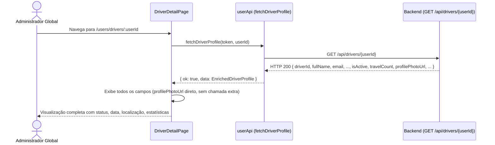
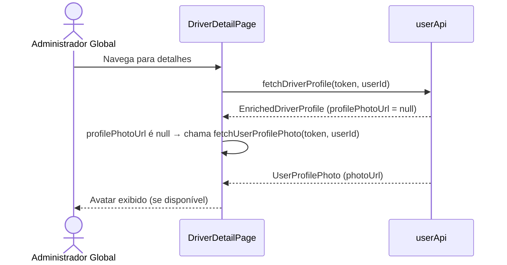

# Documento de Design — user-detail-enhancement-web

---
**Propósito**: Fornecer detalhes suficientes para enriquecer os endpoints de detalhes de usuários no backend e atualizar as páginas de detalhes no front-end para exibir o conjunto completo de dados disponíveis, mantendo todas as ações de atualização e exclusão existentes.

---

## Visão Geral

**Propósito**: Atualmente, a página de detalhes do motorista (`DriverDetailPage`) exibe dados limitados porque o endpoint `GET /api/drivers/{userId}` retorna apenas campos básicos. A página de detalhes do passageiro (`PassengerDetailPage`) é mais completa, mas ainda omite alguns campos. Este spec propõe enriquecer ambos os endpoints do backend e atualizar os tipos/componentes do front-end para consumir e exibir o conjunto completo de dados. A foto de perfil passará a ser incluída diretamente na resposta do perfil enriquecido, eliminando a chamada separada a `fetchUserProfilePhoto` como dependência primária.

**Usuários**: Administradores Globais que acessam as páginas de detalhes para visualizar, atualizar ou excluir contas de motoristas e passageiros.

**Impacto**:
- **Backend**: Endpoints `GET /api/drivers/{userId}` e `GET /api/passengers/{passengerId}` enriquecidos com campos adicionais.
- **Frontend**: `DriverProfile` e `PassengerProfile` em `src/api/userApi.ts` atualizados; `DriverDetailPage` expandida para exibir novos campos; `PassengerDetailPage` estendida com campos faltantes; `fetchUserProfilePhoto` mantida como fallback.

### Objetivos
- Enriquecer `DriverProfile` com: `rg`, `birthdate`, `isActive`, `access`, `city`, `state`, `createdAt`, `categoryTitle`, `travelCount`, `profilePhotoUrl`.
- Enriquecer `PassengerProfile` com: `access`, `city`, `state`, `profilePhotoUrl`.
- Atualizar `DriverDetailPage` para exibir todos os campos novos com layout responsivo.
- Atualizar `PassengerDetailPage` para exibir campos novos (`access`, `city`, `state`).
- Eliminar a chamada separada de `fetchUserProfilePhoto` quando `profilePhotoUrl` estiver disponível no perfil.
- Preservar todas as funcionalidades existentes (troca de veículo, exclusão, navegação).

### Não-Objetivos
- Não alterar a rota ou estrutura de navegação das páginas de detalhes.
- Não implementar edição inline de campos.
- Não adicionar sistema de logs ou auditoria.
- Não modificar as páginas de listagem (`UsersPage`).

---

## Arquitetura

### Análise da Arquitetura Existente

- **DriverDetailPage**: Busca `DriverProfile` via `GET /api/drivers/{userId}`, exibe cards de info, veículo atual, troca de veículo e exclusão.
- **PassengerDetailPage**: Busca `PassengerProfile` via `GET /api/passengers/{passengerId}`, exibe cards de info, departamentos, endereço e exclusão.
- **userApi.ts**: Contém `fetchDriverProfile` e `fetchPassengerProfile` com tipos limitados, e `fetchUserProfilePhoto` separada.
- **DriverProfile** (atual): 7 campos — muito aquém do que o banco de dados possui.
- **PassengerProfile** (atual): 14 campos — relativamente completo, faltando `access`, `city`, `state`.

### Padrão Arquitetural

| Aspecto | Detalhe |
|---------|---------|
| Padrão | Aditivo — campos novos são acrescentados sem remover ou alterar os existentes |
| Limites | Backend enriquece DTOs/consultas SQL; front-end atualiza tipos e componentes de exibição |
| Dados de perfil | `profilePhotoUrl` incluído no perfil enriquecido, eliminando a chamada separada |
| Fallback | Se backend antigo não retornar `profilePhotoUrl`, manter `fetchUserProfilePhoto` como fallback |

### Tecnologia

| Camada | Tecnologia | Mudança |
|--------|-----------|---------|
| Backend | .NET 8, C# 12 | DTOs enriquecidos, SQL com JOINs adicionais |
| Frontend | React + TypeScript | Tipos atualizados, novos cards de exibição |
| Ícones | `lucide-react` | `ShieldCheck`, `ShieldX`, `Calendar`, `MapPin`, `Hash` (já usados no PassengerDetail) |

---

## Fluxo do Sistema

### Fluxo: Visualização de detalhes do motorista (enriquecido)



### Fluxo: Perfil sem profilePhotoUrl (fallback)



---

## Rastreabilidade de Requisitos

| Requisito | Resumo | Componentes | Interfaces |
|-----------|--------|------------|------------|
| 1.1–1.4 | Backend: enriquecer GET /api/drivers/{userId} | Backend DTOs, SQL | — |
| 2.1–2.3 | Backend: enriquecer GET /api/passengers/{passengerId} | Backend DTOs, SQL | — |
| 3.1–3.8 | Web: DriverDetailPage com dados completos | DriverDetailPage, userApi.ts | EnrichedDriverProfile |
| 4.1–4.5 | Web: PassengerDetailPage com dados completos | PassengerDetailPage, userApi.ts | EnrichedPassengerProfile |
| 5.1–5.5 | Web: Tipos TypeScript atualizados | userApi.ts | DriverProfile, PassengerProfile |
| 6.1–6.5 | Preservar funcionalidades existentes | Todos | — |

---

## Componentes e Interfaces

### API / userApi.ts

#### `DriverProfile` (enriquecido)

```typescript
export interface DriverProfile {
  // Campos existentes
  driverId: string
  fullName: string
  email: string
  cpf: string | null
  cnh: string | null
  department: string | null
  vehicle: VehicleInfo | null

  // Novos campos
  rg: string | null
  birthdate: string
  isActive: boolean
  access: string              // 'User' | 'Admin'
  city: string | null
  state: string | null
  createdAt: string
  categoryTitle: string | null
  travelCount: number
  profilePhotoUrl: string | null
}
```

#### `PassengerProfile` (enriquecido)

```typescript
export interface PassengerProfile {
  // Campos existentes (todos preservados)
  passengerId: string
  fullName: string
  email: string
  cpf: string
  rg: string
  registration: string
  birthdate: string
  address: AddressCommand
  publicPartitionId: string
  publicPartitionName: string
  departments: PassengerDepartmentDto[]
  isActive: boolean
  createdAt: string
  solicitationCount: number

  // Novos campos
  access: string              // 'User' | 'Admin'
  city: string | null
  state: string | null
  profilePhotoUrl: string | null
}
```

#### `fetchDriverProfile` (atualizada)

| Campo | Detalhe |
|-------|---------|
| Propósito | Buscar perfil completo do motorista com todos os campos |
| Requisitos | 1.1, 3.1, 5.4 |

A função existente permanece com a mesma assinatura, mas o tipo de retorno agora inclui todos os campos enriquecidos. O tratamento de erro existente é preservado.

#### `fetchPassengerProfile` (atualizada)

| Campo | Detalhe |
|-------|---------|
| Propósito | Buscar perfil completo do passageiro com campos adicionais |
| Requisitos | 2.1, 4.1, 5.5 |

Mesma abordagem: assinatura preservada, tipo de retorno enriquecido.

### UI / DriverDetailPage

#### Modificações no componente

| Campo | Detalhe |
|-------|---------|
| Propósito | Exibir todos os campos do `DriverProfile` enriquecido |
| Requisitos | 3.1–3.8 |

**Responsabilidades & Restrições**
- Se `profilePhotoUrl` estiver presente no `driver`, usar diretamente no `UserAvatar` (sem chamar `fetchUserProfilePhoto`).
- Se `profilePhotoUrl` for `null`/undefined, manter o fallback existente (`fetchUserProfilePhoto`).
- O cabeçalho deve exibir um badge de status ao lado do nome.
- A grid de informações deve ser expandida para incluir:
  - **Nome completo** (existente)
  - **E-mail** (existente)
  - **CPF** (existente)
  - **RG** (novo)
  - **CNH** (existente)
  - **Data de nascimento** (novo)
  - **Nível de acesso** (novo)
  - **Departamento** (existente)
  - **Cidade/Estado** (novo)
  - **Data de cadastro** (novo)
  - **Categoria do veículo** (novo) — exibido na seção de veículo
  - **Total de Viagens** (novo)
- Layout: grid 2 colunas (md+), 1 coluna (mobile), mantendo o padrão `InfoCard`.
- A seção de veículo atual deve exibir a categoria (`categoryTitle`) se disponível.
- Os skeletons de carregamento devem ser ajustados para refletir o maior número de cards.

### UI / PassengerDetailPage

#### Modificações no componente

| Campo | Detalhe |
|-------|---------|
| Propósito | Exibir campos adicionais no perfil do passageiro |
| Requisitos | 4.1–4.5 |

**Responsabilidades & Restrições**
- Se `profilePhotoUrl` estiver presente no `passenger`, usar diretamente (evitando `fetchUserProfilePhoto`).
- Se `profilePhotoUrl` for `null`, manter fallback existente.
- Adicionar cards na grid existente:
  - **Nível de acesso** (`access`) — entre os cards existentes
  - **Cidade/Estado** (`city`/`state`) — se disponíveis, exibir como "Cidade/Estado"
- A grid já possui 9 cards em desktop (2 colunas = 5 linhas). Os novos cards podem exigir ajuste para manter layout equilibrado.
- Todas as seções existentes permanecem inalteradas.

### UI / StatusBadge no cabeçalho

Reutilizar o mesmo componente/padrão de badge usado no `UsersPage` e `PassengerDetailPage`:

```tsx
<span className={`inline-flex items-center gap-1 rounded-full px-2.5 py-0.5 text-xs font-medium ${
  driver.isActive ? 'bg-green-100 text-green-700' : 'bg-red-100 text-red-700'
}`}>
  {driver.isActive ? <ShieldCheck className="h-3.5 w-3.5" /> : <ShieldX className="h-3.5 w-3.5" />}
  {driver.isActive ? 'Ativo' : 'Inativo'}
</span>
```

### Fallback de Foto de Perfil

Para compatibilidade com versões anteriores do backend que ainda não retornam `profilePhotoUrl`:

```typescript
// No loadDriver / loadPassenger:
if (result.ok) {
  const profile = result.data
  setDriver(profile)

  if (profile.profilePhotoUrl) {
    // Campo já veio no perfil enriquecido — usar direto
    setPhotoUrl(profile.profilePhotoUrl)
  } else {
    // Fallback: chamada separada (backend antigo)
    fetchUserProfilePhoto(token, userId).then(photoResult => {
      if (photoResult.ok) setPhotoUrl(photoResult.data.photoUrl)
    })
  }
}
```

---

## Tratamento de Erros

| Condição | Ação |
|----------|------|
| Backend retorna perfil sem `profilePhotoUrl` | Usar fallback `fetchUserProfilePhoto` |
| `isActive` ou outros novos campos ausentes | Tratar como undefined e não exibir (backward compatibility) |
| Erro 404 | Exibir "não encontrado" (já implementado) |
| Erro de rede | Exibir mensagem de erro com botão "Tentar novamente" (já implementado) |

---

## Estratégia de Implementação (Ordem Sugerida)

1. **Backend — Enriquecer DTOs**: Adicionar campos aos DTOs de resposta dos endpoints de detalhes.
2. **Backend — Atualizar SQL**: Modificar as queries para SELECT dos novos campos com JOINs e subqueries.
3. **Frontend — Atualizar tipos TypeScript**: Adicionar campos a `DriverProfile` e `PassengerProfile`.
4. **Frontend — Atualizar DriverDetailPage**: Adicionar novos cards, badge de status, fallback de foto.
5. **Frontend — Atualizar PassengerDetailPage**: Adicionar `access`, `city`, `state`.
